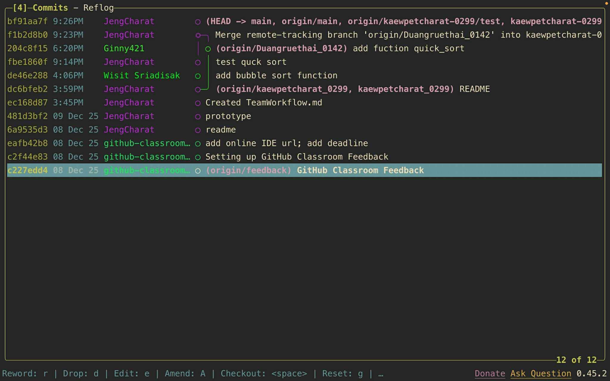

#  Team Workflow Documentation

##  รายชื่อสมาชิกในทีม (3 คน)

| ชื่อ | รหัสนักศึกษา | หน้าที่ |
|------|---------------|----------|
| **นายแก้วเพ็ชรัตน์ สีสันต์ [JengCharat](https://github.com/JengCharat)** | 663380029-9 | - สร้างโปรเจกต์และโครงสร้างฟังก์ชันเริ่มต้น<br>- เขียน Test Function |
| **นายวิสิษฎ์ ศรีอดิศักดิ์[WisitSriadisak](https://github.com/WisitSriadisak)** | 663380234-8 | - Pull โปรเจกต์จาก Git<br>- เขียนอัลกอริทึม **Bubble Sort** |
| **นางสาวดวงฤทัย อัปกาญจน์[Ginny421](https://github.com/Ginny421)** | 663380014-2 | - Pull โปรเจกต์จาก Git<br>- เขียนอัลกอริทึม **Quick Sort** |

---

##  Workflow การทำงานร่วมกันของทีม

### 1. เริ่มต้นโปรเจกต์
- นายแก้วเพ็ชรัตน์[JengCharat](https://github.com/JengCharat)สร้างไฟล์ Python พร้อมฟังก์ชันเริ่มต้นดังนี้:

```python
def quick_sort(arr):
    print("quick sort")
    result = arr
    return arr

def bubble_sort(arr):
    print("bubble sort")
    result = arr
    return arr


user_input = input("enter number(example: 5 6 4): ")
data = list(map(int, user_input.split()))

print("sort:")
print("1 = Bubble Sort")
print("2 = Quick Sort")
choice = input("enter number (1 or 2): ")

if choice == "1":
    result = bubble_sort(data)
    print("Bubble Sort result:", result)
elif choice == "2":
    result = quick_sort(data)
    print("Quick Sort result:", result)
else:
    print("please enter 1 or 2")
```

### 2. สมาชิก Pull โปรเจกต์และพัฒนา
 นายวิสิษฎ์[WisitSriadisak](https://github.com/WisitSriadisak) – Bubble Sort
Pull โปรเจกต์จาก Git
เขียนอัลกอริทึม Bubble Sort ลงใน bubble_sort()
Commit & Push
<br>
 นางสาวดวงฤทัย[Ginny421](https://github.com/Ginny421) – Quick Sort
Pull โปรเจกต์จาก Git
เขียนอัลกอริทึม Quick Sort ลงใน quick_sort()
Commit & Push

### 3. การเขียนฟังก์ชันทดสอบ (Testing)
นายแก้วเพ็ชรัตน์[JengCharat](https://github.com/JengCharat) เขียนฟังก์ชันทดสอบเรียกใช้งานทั้ง Bubble Sort และ Quick Sort เพื่อยืนยันผลลัพธ์ถูกต้อง
### 4. การรวมงาน (Merge)
ตรวจสอบโค้ดของทุกคน
แก้ Conflict (ถ้ามี)
Merge เข้าสู่ main branch


# Git commit graph

